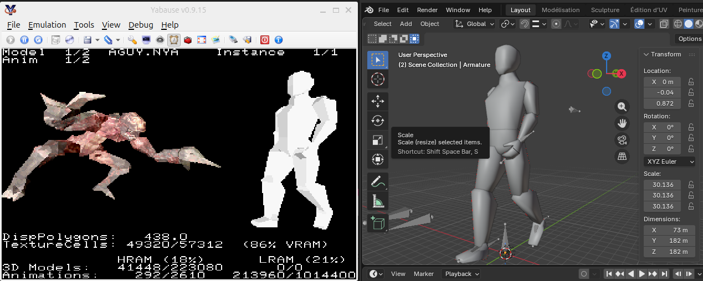

# Saturnate

Blender animation export scripts under a Sega Saturn friendly format + Sega Saturn visualizer for [Saturn Ring Library](https://github.com/ReyeMe/SaturnRingLib) and [Jo Engine](https://github.com/johannes-fetz/joengine), using [ReyeMe's Model Converter](https://github.com/ReyeMe/ModelConverter-linux).



## Installation and usage

Works on both Linux and Windows.

Requires blender 5 and dotnet to be available in the path.

Requires Saturn Ring Library or Jo Engine (or a custom installation if you use SGL only).

1. Place the saturnate_for_jo_engine directory in Jo Engine's Projects/ directory and/or place the saturnate_for_srl directory in srl's Projects/ directory.
2. Place a valid blender file (see below) in the assets/ directory (or use the one that is provided as an example).
3. Run the "generate_model" script for your OS.
4. Run the compilation script for your OS.
5. Run the "run" script for your OS and emulator.

## Blender constraints

This tool aims to enable SGL's style animations to be imported from Blender. That is, models made out of several meshes organized in a hierarchical manner. This implies some restrictions on the model that can be used in Blender. However, SGL's capabilities can be used to their full extent.

* An object cannot be deformed. That is, modern animations where the model is made of a single mesh (object) that is deformed cannot be exported. Rather, the model is made of several objects that move relatively to each other.
* The animation must be driven by an armature.
* Each object must be parented to a bone. This ensures the object's transformations match those of its parent bone. SGL's matrix hierarchy follows the bone hierarchy of the armature.
* Extra bones that are not parent of a mesh can be present in the armature as root bone or leaves, that is, at the very beginning or at an end of the armature. They cannot be intermediary bones between two objects. This allows the use of control bones, like IK targets and pole targets.
* Bones don't have to be connected to one another.
* Each animation must be saved as an Action in the Action Editor and given a Manual Frame Range with a Start and an End.

## Principle

An animated Blender model is exported in 2 parts:
- the animation data is exported with exportBlenderAnimationAng1.py to a custom .MOT format.
- the model itself is exported to Wavefront format (.obj) with exportBlenderWavefront.py (Blender's built-in Wavefront export is not enough); the Wavefront format is then converted to .NYA format thanks to [ReyeMe's Model Converter](https://github.com/ReyeMe/ModelConverter-linux). The resulting files can be easily used in a Sega Saturn game. 

The Saturnate visualizer expects files to bear matching names, e.g. MODEL.MOT and MODEL.NYA, TEST.MOT and TEST.NYA.

Please note that despite being fairly optimized, the .MOT file format and the code itself can always be further customized or optimized to cater to one's need.

## Script usage

### Animation export script
```batch
blender --background --python $(COMMON_DIR)/exportBlenderAnimationAng1.py -- [--reverse]
```
The --reverse option will trigger the export of the animation(s) in reverse.

### Wavefront export script
```batch
blender --background --python $(COMMON_DIR)/exportBlenderWavefront.py --
```

The Wavefront export script not only exports the model under the Wavefront format, it also correctly positions objects (meshes) and their centres of rotation for use within the Saturn's system of coordinates and rotations.

See ReyeMe's [explanations about how to use his ModelConverter](https://github.com/ReyeMe/ModelConverter-linux).

## Visualizer

The visualizer is a tool running on a Sega Saturn emulator or on real hardware that allows the user to examine the exported animations. It allows you to choose the file to examine, manipulate the model on screen, choose/pause the animation and display statistics (RAM/VRAM usage, number of displayed polygons).

Pressing the Start button brings up a menu with a help screen explaining the commands.

A "Stress test" mode is provided as a way to load multiple animated models at once and examine the impact on performance. Combined with the statistics, it gives a good idea of the cost of displaying a set of models together on screen. Please remember that the performance displayed by an emulator will usually differ from that on real hardware when it comes to slowdowns.

## .MOT file format

The .MOT (Motion) format is a binary animation format provided as an example. The exact format change depending on the version. MOT format 0 version 0 is inferior to MOT format 0 version 1 in every way. The later is a fairly optimized, supports rotations, position shifts but does not support scaling or a bone (as defined in Blender) to change length for a given animation. This is probably the sweet spot that is needed by 99% of all animation usage without losing efficiency supporting the remaining 1%.

Each file is composed of three main sections, packed linearly in memory:
* Header : Contains the file metadata, including the number of animations and the number of meshes per model.
* Animation Specifications : sub-headers describing all the animation (frame timing, pose count, and data offsets). One per animation.
* Transform Data: The raw transformation data (Translation, Rotation, Hierarchy control, Bones length and position).
The philosophy is data oriented:

header, animationSpec1, animationSpec2, ..., animationSpecN, animationData1, animationData2, ..., animationDataN.

This goes contrary to the .NYA file format, which is more object oriented:

header, spec1, data1, spec2, data2, ..., specN, dataN.

The exact file format is not explained here but can be understood by reading the fairly simple loading procedure located in src/core/format/animation1.c.

## Ideas for improvement

* Rather than storing x, y and z offset at all, it's possible to add a constraint to a model: all the bones must be connected. That way, the starting point of a bone is no longer determined by a x, y and z offset from its parent bone, but rather by a rotation + boneLength from its parent bone. That means x, y and z are replaced in most cases by a single data : boneLength. Already as is, most bones are connected to a parent bone, meaning we already have x = 0, y = 0 and z = boneLength in most cases, wasting space on x and y.
* Support of scaling.
* SGL constraints the objects to be animated in a very compartmentalized way, _e.g._ an arm must be completely independent from the rest of the body, as in the Resident Evil games. Allowing to rotate a set of vertices rather than an object (SGL's PDATA concept) would allow for a smoother animation where the mesh is seamlessly deformed by the rotation of a constituent object. Such effects can be found in Metal Gear Solid or Final Fantasy IX (maybe other FF games, I haven't checked really).